[](https://classroom.github.com/a/LLvi-T55)
[](https://classroom.github.com/online_ide?assignment_repo_id=22402971&assignment_repo_type=AssignmentRepo)
<div align="center">


# ☁️ Praktikum Cloud-Native Application Development

### *Membangun Aplikasi Modern dengan Container dan Orchestration*

**Laboratorium Informatika**  
**Fakultas Teknik - Universitas Muhammadiyah Makassar**

---

[](https://github.com/devnolife)

</div>

---

## 📋 Informasi Mata Kuliah

| Atribut | Detail |
|---------|--------|
| **Kode Mata Kuliah** | `CW6552021552` |
| **Semester** | V (Lima) |
| **SKS** | 3 SKS |
| **Program Studi** | Informatika |
| **Fakultas** | Teknik |
| **Universitas** | Universitas Muhammadiyah Makassar |

---

## 📘 Deskripsi

> Mata kuliah ini memperkenalkan prinsip-prinsip inti **arsitektur cloud-native**. Mahasiswa akan belajar cara mengemas aplikasi menggunakan **kontainerisasi (Docker)**, mengelola kontainer dalam skala besar dengan **orkestrasi (Kubernetes)**, dan memahami konsep **immutable infrastructure**.

## 🎯 Capaian Pembelajaran

<table>
<tr>
<td>

| No | Capaian |
|----|---------|
| 1 | Memahami prinsip **cloud-native architecture** |
| 2 | Menguasai **containerization** dengan Docker |
| 3 | Mampu melakukan **container orchestration** dengan Kubernetes |
| 4 | Mengimplementasikan **microservices pattern** |
| 5 | Menerapkan **best practices** cloud-native deployment |

</td>
</tr>
</table>

## 📚 Roadmap Pembelajaran

> Materi dirancang untuk **8 pertemuan** dengan pendekatan *learning by doing*

```mermaid
graph LR
    A[☁️ Intro] --> B[🐳 Docker]
    B --> C[📦 Dockerfile]
    C --> D[🔗 Compose]
    D --> E[📤 Registry]
    E --> F[☸️ K8s Intro]
    F --> G[🚀 Deploy]
    G --> H[🏆 Project]
```



| Pertemuan | Topik | Teknologi Utama | Status |
|:---------:|-------|-----------------|:------:|
| **01** | [Introduction to Cloud-Native Principles](./pertemuan-01) | 12-Factor App, Microservices | 🟢 |
| **02** | [Docker Fundamentals: Images & Containers](./pertemuan-02) | Docker CLI, Images, Containers | 🟢 |
| **03** | [Dockerfile Best Practices](./pertemuan-03) | Multi-stage builds, Optimization | 🟢 |
| **04** | [Docker Compose untuk Multi-Container Apps](./pertemuan-04) | docker-compose.yml, Networking | 🟢 |
| **05** | [Container Registry](./pertemuan-05) | Docker Hub, Private Registry | 🟢 |
| **06** | [Kubernetes Architecture & Concepts](./pertemuan-06) | Minikube, kubectl, Pods | 🟢 |
| **07** | [Pods, Deployments, dan Services](./pertemuan-07) | Deployments, Services, Scaling | 🟢 |
| **08** | [UTS: Containerized Application](./pertemuan-08) | Full-stack deployment project | 🎯 |

## 🚀 Quick Start

### Prerequisites

<details>
<summary>📋 Klik untuk melihat System Requirements</summary>

**Required Software:**
- ✅ Docker Desktop atau Docker Engine
- ✅ Docker Compose
- ✅ kubectl (Kubernetes CLI)
- ✅ Minikube (untuk local Kubernetes)
- ✅ Git
- ✅ Code Editor (VS Code recommended)

**System Requirements:**
- 🖥️ CPU: 4 cores (8 recommended)
- 💾 RAM: 8GB minimum (16GB recommended)
- 💽 Disk: 50GB free space
- 🖥️ OS: Linux, macOS, or Windows 10/11 with WSL2

</details>

### ⚡ Quick Installation

<details>
<summary>🪟 Windows (with WSL2)</summary>

```powershell
# Install WSL2
wsl --install

# Install Docker Desktop
# Download from: https://www.docker.com/products/docker-desktop

# Install kubectl
choco install kubernetes-cli

# Install Minikube
choco install minikube
```

</details>

<details>
<summary>🍎 macOS</summary>

```bash
# Install Docker Desktop
brew install --cask docker

# Install kubectl
brew install kubectl

# Install Minikube
brew install minikube
```

</details>

<details>
<summary>🐧 Linux</summary>

```bash
# Install Docker
curl -fsSL https://get.docker.com -o get-docker.sh
sudo sh get-docker.sh

# Install Docker Compose
sudo curl -L "https://github.com/docker/compose/releases/latest/download/docker-compose-$(uname -s)-$(uname -m)" -o /usr/local/bin/docker-compose
sudo chmod +x /usr/local/bin/docker-compose

# Install kubectl
curl -LO "https://dl.k8s.io/release/$(curl -L -s https://dl.k8s.io/release/stable.txt)/bin/linux/amd64/kubectl"
sudo install -o root -g root -m 0755 kubectl /usr/local/bin/kubectl

# Install Minikube
curl -LO https://storage.googleapis.com/minikube/releases/latest/minikube-linux-amd64
sudo install minikube-linux-amd64 /usr/local/bin/minikube
```

</details>

### ✅ Verification

```bash
# Verify installations
docker --version
docker-compose --version
kubectl version --client
minikube version

# Start Minikube
minikube start --cpus=2 --memory=4096

# Verify Kubernetes
kubectl cluster-info
kubectl get nodes
```

---

## 📖 Panduan Penggunaan

### Workflow Setiap Pertemuan

```
📖 Baca README → 🔧 Setup → 💻 Hands-on → 🧪 Practice → ✅ Submit
```

### Struktur Repository

```
📁 cloud-native-practicum/
├── 📄 README.md
├── 📁 examples/
│   ├── docker-samples/
│   ├── k8s-manifests/
│   └── compose-files/
├── 📁 pertemuan-01/
│   ├── 📄 README.md
│   └── 📁 exercises/
└── 📁 pertemuan-08/
    └── 📄 README.md (UTS Guidelines)
```

---

## 💻 Tech Stack

<div align="center">

### 🐳 Containerization

| Technology | Purpose |
|:----------:|---------|
|  | Container runtime |
|  | Multi-container orchestration |
|  | Alternative container tools |

### ☸️ Orchestration

| Technology | Purpose |
|:----------:|---------|
|  | Container orchestration |
|  | Local Kubernetes |
|  | Kubernetes CLI |
|  | Package manager (advanced) |

### 🛠️ Development Tools

| Tool | Purpose |
|:----:|---------|
|  | IDE |
|  | Version control |

### ☁️ Cloud Platforms (Optional)

| Platform | Service |
|:--------:|---------|
|  | EKS (Elastic Kubernetes Service) |
|  | GKE (Google Kubernetes Engine) |
|  | AKS (Azure Kubernetes Service) |
|  | DOKS |

</div>

---

## 📊 Sistem Penilaian

<div align="center">

```
┌─────────────────────────────────────────────────────────┐
│                    DISTRIBUSI NILAI                      │
├─────────────────────────────────────────────────────────┤
│  ████████░░░░░░░░░░░░░░░░░░░░░░░░░░░░░░░  10% Kehadiran │
│  ██████████████████████████░░░░░░░░░░░░░  30% Tugas     │
│  ████████████████████░░░░░░░░░░░░░░░░░░░  25% UTS       │
│  ██████████████████████████████░░░░░░░░░  35% UAS       │
└─────────────────────────────────────────────────────────┘
```

</div>

| Komponen | Bobot | Keterangan |
|----------|:-----:|------------|
| 📋 Kehadiran & Partisipasi | 10% | Minimal kehadiran 75% |
| 📝 Tugas Mingguan | 30% | Weekly Labs |
| 📊 UTS | 25% | Mid-term Project |
| 🎯 UAS | 35% | Final Project & Presentation |

### ✅ Kriteria Kelulusan

- [x] Nilai akhir minimal: **60 (D)**
- [x] Kehadiran minimal: **75%**
- [x] Mengumpulkan minimal **75%** tugas
- [x] Mengikuti UTS dan UAS

---

## 📝 Submission Guidelines

### Format Struktur Folder

```
📁 NIM_Nama_PertemuanXX/
├── 📁 docker/
│   ├── Dockerfile
│   └── docker-compose.yml
├── 📁 kubernetes/
│   ├── deployment.yaml
│   └── service.yaml
├── 📁 src/
│   └── application-code/
├── 📁 docs/
│   └── README.md
└── 📁 screenshots/
```

### ✅ Checklist Sebelum Submit

- [ ] ✓ Code bisa di-run tanpa error
- [ ] ✓ Dockerfile optimized
- [ ] ✓ Documentation lengkap
- [ ] ✓ Screenshots included
- [ ] ✓ Best practices applied
- [ ] ✓ Health checks implemented

---

## 🔧 Troubleshooting

<details>
<summary>🐳 Docker Issues</summary>

**Docker daemon not running:**
```bash
# Linux
sudo systemctl start docker

# Windows/Mac - Start Docker Desktop application
```

**Permission denied:**
```bash
# Linux - add user to docker group
sudo usermod -aG docker $USER
# Logout and login again
```

**Port already in use:**
```bash
# Find process using port
sudo lsof -i :8080

# Kill process
kill -9 <PID>
```

</details>

<details>
<summary>☸️ Kubernetes Issues</summary>

**Minikube won't start:**
```bash
# Delete and recreate
minikube delete
minikube start --cpus=2 --memory=4096

# Check system resources
minikube status
```

**Pod stuck in Pending:**
```bash
# Describe pod for errors
kubectl describe pod <pod-name>

# Check node resources
kubectl describe node
```

**ImagePullBackOff error:**
```bash
# Check image name and tag
kubectl describe pod <pod-name>

# Pull image manually
docker pull <image-name>
```

</details>

---

## 📚 Referensi & Resources

<details>
<summary>📖 Official Documentation</summary>

| Technology | Documentation |
|------------|---------------|
| Docker | [docs.docker.com](https://docs.docker.com/) |
| Kubernetes | [kubernetes.io/docs](https://kubernetes.io/docs/) |
| Docker Compose | [docs.docker.com/compose](https://docs.docker.com/compose/) |

</details>

<details>
<summary>🎓 Learning Resources</summary>

- [Docker Getting Started](https://docs.docker.com/get-started/)
- [Kubernetes Basics](https://kubernetes.io/docs/tutorials/kubernetes-basics/)
- [Play with Docker](https://labs.play-with-docker.com/)
- [Katacoda Interactive Learning](https://www.katacoda.com/)

</details>

<details>
<summary>📚 Recommended Books</summary>

- *"Docker Deep Dive"* by Nigel Poulton
- *"Kubernetes Up & Running"* by Kelsey Hightower
- *"Cloud Native DevOps with Kubernetes"* by John Arundel

</details>

<details>
<summary>👥 Communities</summary>

- [Docker Community](https://www.docker.com/community/)
- [Kubernetes Slack](https://kubernetes.slack.com/)
- [CNCF Community](https://www.cncf.io/community/)

</details>

---

## 💡 Cloud-Native Best Practices

<div align="center">

### 🐳 Docker Best Practices

| # | Practice |
|:-:|----------|
| 1 | Use official base images |
| 2 | Minimize layer count |
| 3 | Use multi-stage builds |
| 4 | Don't run as root |
| 5 | Use .dockerignore |
| 6 | Implement health checks |
| 7 | Keep images small |
| 8 | Version your images |

### ☸️ Kubernetes Best Practices

| # | Practice |
|:-:|----------|
| 1 | Use namespaces |
| 2 | Set resource limits |
| 3 | Implement readiness/liveness probes |
| 4 | Use ConfigMaps and Secrets |
| 5 | Label everything |
| 6 | Use rolling updates |
| 7 | Implement monitoring |
| 8 | Plan for failures |

</div>

---

## 🎯 Cloud-Native Mindset

<div align="center">

| 💡 | Principle |
|:--:|-----------|
| 1️⃣ | **Containers are ephemeral** - Design for disposability |
| 2️⃣ | **Configuration is external** - Use env vars and ConfigMaps |
| 3️⃣ | **Logs go to stdout** - Let the platform handle logging |
| 4️⃣ | **One process per container** - Keep containers focused |
| 5️⃣ | **Immutable infrastructure** - Replace, don't modify |
| 6️⃣ | **Declarative > Imperative** - Describe desired state |
| 7️⃣ | **Fail fast and loud** - Surface errors immediately |
| 8️⃣ | **Automate repetitive tasks** - Infrastructure as Code |

</div>

---

## 👥 Tim Pengembang

<div align="center">

### 🏛️ Laboratorium Informatika
**Fakultas Teknik - Universitas Muhammadiyah Makassar**

---

| Role | Nama |
|------|------|
| 👨‍💻 **Developer & Maintainer** | [@devnolife](https://github.com/devnolife) |
| 👨‍🏫 **Dosen Pengampu** | [Nama Dosen] |
| 👨‍🔬 **Asisten Praktikum** | [Nama Asisten] |

</div>

---

## ⚠️ Catatan Penting

> [!WARNING]
> - **Docker Desktop** requires license for large enterprises
> - **Minikube** is for development only, not production
> - **Always backup** persistent data
> - **Never commit secrets** to git
> - **Test locally** before deploying
> - **Monitor resource usage**
> - **Keep images updated** for security

---

<div align="center">

## 🚀 Let's Build Cloud-Native Apps!

Mulai dari [**Pertemuan 01**](./pertemuan-01) dan kuasai Docker dan Kubernetes!

**Welcome to the Cloud-Native World! ☁️🐳☸️**

---

### 📧 Kontak & Support

[](https://github.com/devnolife)
[](mailto:devnolife@gmail.com)

---

<sub>

**Laboratorium Informatika - Fakultas Teknik**  
**Universitas Muhammadiyah Makassar**  

---


**Last Updated:** December 2025 | **Version:** 2.0

Made with ❤️ by [devnolife](https://github.com/devnolife)

</sub>

</div>
